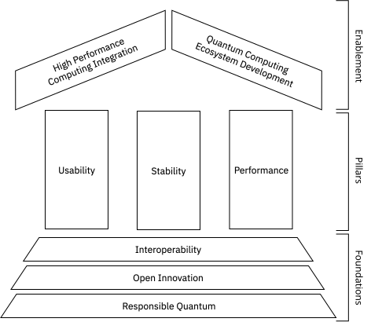

# Qiskit Technical Vision
**Version 1 (Sep 2025)**

## Introduction

Qiskit[^1] is a high-performance software stack built to help developers and researchers harness the full power of quantum computers at the utility scale and, ultimately, achieve quantum advantage.  
Qiskit embraces a collaboration-driven approach that emphasizes accessibility and extensibility, fostering innovation in quantum computing across IBM, the broader quantum industry, and the global community.

[^1]: In this document, the term *Qiskit* refers to the general collection of software that IBM Quantum uses to execute workloads on quantum computers. See the [Introduction to Qiskit](https://quantum.cloud.ibm.com/docs/en/guides#introduction-to-qiskit) guide for details.

Grounded in foundational principles of responsibility, openness and interoperability (*Foundations*), Qiskit's core values (*Pillars*) are usability, stability, and performance.
These values drive Qiskit's impact for users and reinforce its overarching mission of enabling the quantum computing community toward quantum advantage (*Enablement*).

## Background and Scope

There is a tradition of foundational documents in developer communities (for example, [Debian Free Software Manifesto](https://www.debian.org/doc/manuals/project-history/manifesto.en.html) and [OpenStack’s Technical Vision](https://governance.openstack.org/tc/reference/technical-vision.html)) that help participants align around shared values and a common direction.
In a similar spirit, this Qiskit Technical Vision defines the principles, commitments, and aspirations that currently guide Qiskit's development.

Its purpose is to align contributors and stakeholders around a common direction, clarify what Qiskit stands for, and provide a foundation for transparent and principled growth without prescribing rigid rules or locking in current implementations. It is, therefore, a statement of intent — not a binding contract.

This is a living document; all changes are explicit, reasoned, and clearly explained in a PR.
Principles that are more foundational are expected to remain stable long-term.
In contrast, aspects related to *Enablement* are more dynamic and may evolve more frequently as priorities shift.

While this technical vision reflects IBM’s current priorities and informs decision-making within the Qiskit software stack, it does not diminish the value of community-led initiatives.
Efforts from the broader quantum computing community, whether aligned with IBM’s roadmap or taking alternative approaches, are essential to advancing quantum technologies.
This vision is not meant to restrict exploration but to provide context for Qiskit’s priorities, helping contributors and users understand how it fits within a broader, collaborative landscape.

---

## Foundations

In increasing level of specificity, the foundational principles of Qiskit are: **Responsible Quantum**, **Open Innovation**, and **Open Interoperability**.

### Responsible Quantum commitments

Qiskit subscribes to the [IBM's Responsible Quantum principles](https://www.ibm.com/quantum/blog/responsible-quantum), which in turn are based of other initiatives, such us [Open Quantum Institute's objectives](https://open-quantum-institute.cern/) and [World Economic Forum’s Quantum Computing Governance Principles](https://www.weforum.org/publications/quantum-computing-governance-principles/).
 
Key commitments to Responsible Quantum include:

 - **Ethical development**: IBM is committed to responsible quantum computing by promoting innovation that benefits society. This involves prioritizing use cases with positive societal impact and making principled decisions aligned with ethical standards.
 - **Transparency and reproducibility**: Qiskit's tools, methods, and benchmark design and results can be independently verified, promoting trust and accountability.
 - **Fostering a welcoming, diverse, and inclusive community for all**: IBM Quantum is responsible for creating an ecosystem that represents the diversity of the world at large and is inclusive of people of all backgrounds, experiences, and abilities. [Qiskit's Code of Conduct](https://docs.quantum.ibm.com/open-source/code-of-conduct) establishes guidelines for respectful and inclusive interactions within the community, as well as the mechanisms for enforcing them.

### Open Innovation commitments

Aligned with [other actors in the quantum software scene](https://www.eqsi.org/about/quantum-software-manifesto/), Qiskit is built on the principle that achieving quantum advantage will be a collective achievement. Progress in quantum computing requires creativity, collaboration, and transparency across the entire quantum software community. By making its core accessible, fostering contributions from diverse participants, and encouraging innovation beyond its own walls, Qiskit ensures that advances are driven not only by IBM, but also by the collective ingenuity and shared responsibility of the global quantum ecosystem.

Key commitments to open innovation include:

- **Open-source development of key components**: By adopting an open-source model with permissive licensing in the main components, Qiskit enables researchers, developers, and organizations to freely use, modify, and extend its tools. 
- **Cultivating a rich ecosystem of extensions and integrations**: The essence of Qiskit is defined by what can be built with it. Tools developed on top of the stack will be key to achieving quantum advantage. Qiskit actively encourages and promotes non-IBM extensions, including support for non-IBM quantum hardware and architectures.
- **Transparency in the communication**: Qiskit's open development model welcomes diverse opinions and feedback to shape its evolution. While final decisions align with IBM’s strategic interests as a company, IBM has a responsibility to clearly communicate the rationale behind them.

### Interoperability commitments

Qiskit is committed to interoperability whenever is possible, enabling users to design and execute quantum programs across various quantum frameworks, projects, or devices without being locked into specific technology or hardware provider.

Key commitments to interoperability include:

 - **Support a diverse quantum hardware landscape**: Qiskit is designed to support a wide range of quantum hardware platforms and services. This support may be driven by IBM, contributed by third parties, or developed collaboratively. Qiskit enables users to run their programs in various quantum providers, giving them the flexibility to choose the best available hardware for their needs without having to learn a new framework.
- **Build bridges among frameworks, platforms, and architectures is crucial**: By supporting the exchange of open standards and formats like OpenQASM, Qiskit encourages developers to leverage the strengths of each tool or framework beyond Qiskit. In this way quantum programs can be easily shared, modified, and executed across different platforms.
- **Fair competition**: While Qiskit follows IBM’s strategic direction, its open initiative nature allows for alternative efforts to take different paths. IBM remains committed to ensuring that its decisions do not actively hinder other initiatives or deliberately disable competitors, even when they build upon Qiskit’s services, design, or code.

---

## Pillars

The Qiskit Pillars are what Qiskit should be known for.
They are what Qiskit developers consider valuable, because they have the potential to enablement users and developers to perform their tasks and experiments.
In short, these three aspects are key to enabling users to move steadily towards quantum advantage: **Usability**, **Performance**, and **Stability**.

### Usability pillar

Qiskit strives to lower the barrier to quantum computing by providing an extensible and accessible interface for creating, optimizing, and executing quantum programs. By delivering well-documented tools, user-friendly APIs, and comprehensive resources for learning and exploration, Qiskit empowers users of all backgrounds to engage with quantum technologies.

Usability-driven aspects include:

 - **Simplified workflows for quantum development**: Qiskit's access model to quantum hardware is based on the notion of primitives—abstractions that encapsulate execution details while providing knobs to control certain aspects of that execution.
 - **Good documentation and educational materials**: Documentation and educational materials (such as tutorials and guides) are the main ways in which Qiskit communicates with its users. It is crucial that these resources are clear, navigable, actionable, and up-to-date.
 - **Consider user feedback**: While IBM's strategy may set the initial direction, Qiskit considers important to actively engage with the research and development community to understand and address their needs.

### Stability Pillar

As a software stack designed to serve as a foundation for building quantum applications, Qiskit places a strong emphasis on stability.
This commitment includes applying sound software engineering practices such as thorough testing and versioning, along with transparent communication about upcoming changes.
Qiskit recognizes that consistency and reliability are essential to cultivating a robust and trustworthy software ecosystem.

Stability-driven aspects include:

 - **Rigorous testing and quality assurance**: Each release or change undergoes careful validation to detect potential transition issues and ensure reliability.
 - **Clear deprecation policies and backward compatibility safeguards**: Well-defined processes help users adapt to changes with minimal disruption. When breaking changes are necessary to meet the demands of a rapidly evolving quantum technology, Qiskit communicates them clearly and in advance.
 - **Transparent roadmap and proactive communication**: Open communication channels and roadmap updates help mitigate the impact of breaking changes by preparing the community well ahead of time.

### Performance Pillar

Scaling toward quantum advantage requires software that prioritizes performance.
Qiskit's performance covers multiple dimensions, including runtime speed, memory footprint, and total execution round-trip time, with a strong focus on helping users achieve meaningful results from their quantum experiments and applications through techniques such as circuit optimizations and error mitigation.

Performance-driven aspects include:

 - **State-of-the-art transpilation strategies**: Qiskit is constantly integrating new quantum circuit optimization algorithms to generate better and faster results. This includes research results from IBM as well as results published by others.
 - **Flexibility in the trade-offs to adjust to user needs**: Different aspects of the performance might have different priorities for different users. Qiskit aims to provide users with the flexibility needed to adjust against those priorities.
- **Extensibility for use-case-specific performance**: Specific use cases require customization to extract maximum performance in a particular setting. Qiskit's extensibility features enable third parties to integrate specialized research or optimizations into the stack, allowing tailored improvements for particular needs.

---

## Enablement

All efforts in Qiskit are devoted to empowering the quantum software user towards quantum advantage.
This broad definition of *user* includes, but it is not limited to, developers, researchers, entrepreneurs, educators, students, and hobbyists.

As such, the user's needs to push the boundaries of quantum computing are at the heart of Qiskit's purpose.
Across all potential scenarios for said user, Qiskit currently focuses on advancing integration with high-performance computing and nurturing the broader quantum software ecosystem.

### High-Performance Computing Integration

As quantum devices continue to scale, they are expected to play an integral role in next-generation high-performance computing (HPC) systems, collaborating with classical processors to tackle complex computational challenges. Qiskit supports this integration by enabling efficient workflows and flexible use of quantum technologies, promoting broad adoption across diverse computational environments.

### Quantum Computing Ecosystem Development

Qiskit supports not only IBM products and services but also a wide ecosystem of enterprises, startups, universities, research centers, governmental institutions, and independent projects. It fosters an environment where these diverse actors can build upon its capabilities. Qiskit recognizes that a wide range of efforts may rely on its platform and strives to uphold that trust responsibly.

---

## Limitations

Qiskit's open, transparent, and extensible nature supports IBM’s mission to bring useful quantum computing to the world.
As an IBM product, its development, governance, access, and distribution are subject to important constraints, such as:

 - **Jurisdictional compliance**: Like all products and services maintained by IBM, Qiskit is bound by the legal and regulatory frameworks of the jurisdictions in which IBM operates.
   This includes compliance with export controls, trade sanctions, and embargo policies, which may restrict access or contributions from certain regions or entities.

 - **IBM contractual confidentiality**: Qiskit's development is constrained by IBM's contractual commitments.
   Agreements with customers, partners, and collaborators may influence priorities and direction, and certain details cannot be discussed publicly to respect confidentiality obligations.

 - **Strategic boundaries**: While Qiskit encourages broad community participation, its core direction is shaped by IBM’s strategic priorities.
   This may influence the scope or timing of certain features and the review process for external contributions.

 - **Hardware-Centric optimizations**: Although Qiskit supports multiple quantum backends, some advanced capabilities are optimized for IBM Quantum systems.
   Nonetheless, IBM actively encourages third parties to extend and adapt features for a wide range of hardware providers.

These limitations reflect the practical realities of operating within a global, regulated, and commercially supported ecosystem and are balanced by Qiskit’s commitment to openness, interoperability, and transparent innovation.

## Conclusions

This technical vision outlines Qiskit's guiding principles and priorities as it evolves to meet the demands of a growing quantum software ecosystem.
By grounding its development in responsibility, openness, and interoperability, and focusing on usability, stability, and performance, Qiskit aims to empower its users, community, and contributors.

As quantum computing advances, Qiskit remains committed to enabling meaningful progress through collaboration, transparency, and extensibility.
This vision is not static; it is intended to evolve with the community it serves and with IBM’s strategic view of the future of quantum technologies.

The goal of making this document public is not only to provide a shared foundation, but also to clearly communicate current priorities and document when they change.
